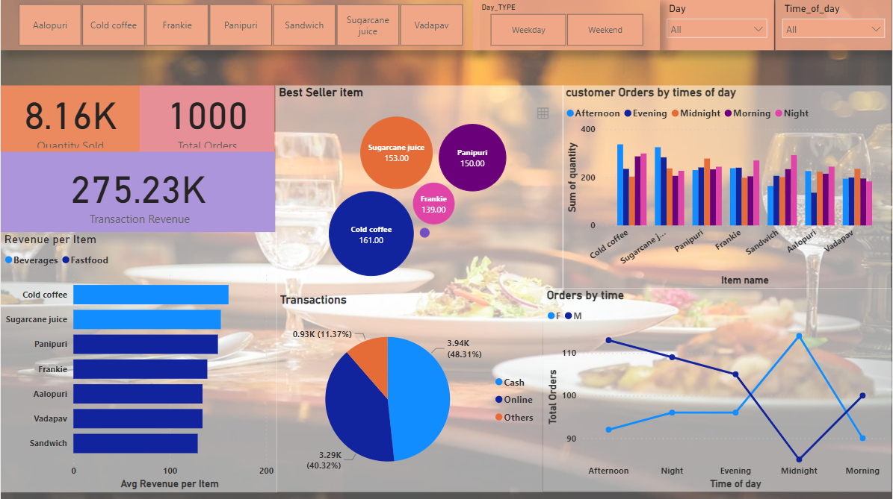

# NYC Restaurant Sales Analysis

This End to End project focuses on analyzing the restaurant landscape in 
New York City through a comprehensive end-to-end approach.
Beginning with data collection from API(rapid API) 
Subsequent data cleaning ensures accuracy and consistency, 
followed by detailed analysis in Excel to unveil trends and patterns. 
Leveraging SQL, a robust database is created to house 
the refined data, enabling efficient querying and answering   of pertinent business questions. 
The insights gleaned from SQL queries guide strategic decisions, informed by metrics suchas revenue,orders,best seller items. Moving to visualization, 
Power BI is utilized to craft dynamic dashboards, offering stakeholders intuitive access to key
insights. The final step involves publishing the 
dashboard on the web, ensuring widespread accessibility
while maintaining data security. 

## Objective
 
 As an Enthusiastic Data Analyst ,the objective was to provide useful insights to the client based on available Data and to answer below business questions 

•	How was the impact of each item on total revenue generated?

•	What is the distribution of sales across different transaction types?

•	Do sales patterns differ based on the combination of gender and time of sale?

•	How sales are changing through out the week based on each day also weekday/weekend?

•	What was the best item based on the timeofsale?

## Languages and Tools

Language: SQL,Python

Database: Db Browser SQLite Server 

Data Visualization: Microsoft Power BI

Tools:Excel,JupiterNotebook

## Workflow

Step 1: Data Collection:
    Data for the project was collected through an API, providing raw information for analysis and processing.

Step 2: Data Cleaning in Excel:
    Data was cleaned in Excel like removing duplicates,dealing with NULL values etc

Step 3: Statistical ,Exploratory Data Analysis:
    Now the cleaned excel was used to do some EDA,Like using Pie Charts,Histograms and statistical analysis using some inbuilt excel functions

Step 4.Create SQL Database and Fetching Queries:
    Here we created a database in SQL server, created a table in database and connected excel to database and wrote some queries to answer some business questions

Step 5.Live Dashboard Creation (PowerBI):Created a dashboard using the data by pinning tiles with KPI’s mentioned alongside presenting visual insights about the best seller item, revenue generated based on type of transactions etc.

## Dashboard

